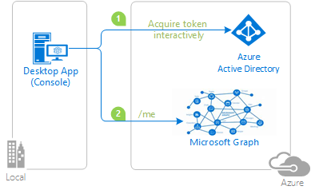

# Using the Microsoft identity platform to call Microsoft Graph API from a multi-target console application on National clouds.

## About this sample

### Overview

This sample demonstrates a .NET Desktop (Console) application calling Microsoft Graph on National clouds.

1. The .NET Desktop (Console) application uses the Microsoft Authentication Library (MSAL) to obtain a JWT access token from a National cloud Azure Active Directory (Azure AD)
2. The access token is used as a bearer token to authenticate the user when calling Microsoft Graph.

National clouds (aka Sovereign clouds) are physically isolated instances of Azure. These regions of Azure are designed to make sure that data residency, sovereignty, and compliance requirements are honored within geographical boundaries.

In addition to the public cloud​, Azure Active Directory is deployed in the following National clouds:  

- Azure US Government
- Azure China 21Vianet
- Azure Germany

Note that enabling your application for National clouds requires you to:

- register your application in a specific portal, depending on the cloud
- use a specific authority, depending on the cloud in the config file for your application
- in case you want to call the graph, this requires a specific Graph endpoint URL, depending on the cloud.

More details in [Authentication in National Clouds](https://docs.microsoft.com/en-us/azure/active-directory/develop/authentication-national-cloud)

## How to run this sample

To run this sample, you can follow the same steps on [the first sample in this tutorial](https://github.com/Azure-Samples/ms-identity-dotnet-desktop-tutorial/tree/master/1-Calling-MSGraph/1-1-AzureAD) but using the desired National cloud portal to create the application.

To use the PowerShell script that **automatically** creates the Azure AD application for this sample in your National cloud, please use the parameter `-AzureEnvironmentName` [as described in this document](https://github.com/Azure-Samples/ms-identity-dotnet-desktop-tutorial/blob/master/1-Calling-MSGraph/1-1-AzureAD/AppCreationScripts/AppCreationScripts.md#running-the-script-on-azure-sovereign-clouds).

### Configure the client app (Console-Interactive-MultiTarget-v2) to use your app registration

Open the project in your IDE (like Visual Studio) to configure the code.

1. Open the `Console-Interactive-MultiTarget\appsettings.json` file
1. Find the app key `Instance` and replace the existing value with the [correspondent endpoint for your National clouds](https://docs.microsoft.com/en-us/azure/active-directory/develop/authentication-national-cloud#azure-ad-authentication-endpoints). 
1. Find the app key `ClientId` and replace the existing value with the application ID (clientId) of the `Console-Interactive-MultiTarget-v2` application copied from the Azure portal.
1. Find the app key `TenantId` and replace the existing value with your Azure AD tenant ID.
1. Find the app key `GraphApiUrl` and replace the existing value with the Microsoft Graph endpoint for your National clouds. [See this reference for more info on which graph endpoint to use](https://docs.microsoft.com/graph/deployments#microsoft-graph-and-graph-explorer-service-root-endpoints).

## Community Help and Support

Use [Stack Overflow](http://stackoverflow.com/questions/tagged/msal) to get support from the community.
Ask your questions on Stack Overflow first and browse existing issues to see if someone has asked your question before.
Make sure that your questions or comments are tagged with [`azure-active-directory` `msal` `dotnet`].

If you find a bug in the sample, please raise the issue on [GitHub Issues](../../../../issues).

To provide a recommendation, visit the following [User Voice page](https://feedback.azure.com/forums/169401-azure-active-directory).

> [Consider taking a moment to share your experience with us.](https://forms.office.com/Pages/ResponsePage.aspx?id=v4j5cvGGr0GRqy180BHbR73pcsbpbxNJuZCMKN0lURpUREhEVDBOTFBMUVRPUElBUE5WMjdPQ1RaMiQlQCN0PWcu)

## Contributing

If you'd like to contribute to this sample, see [CONTRIBUTING.MD](/CONTRIBUTING.md).

This project has adopted the [Microsoft Open Source Code of Conduct](https://opensource.microsoft.com/codeofconduct/). For more information, see the [Code of Conduct FAQ](https://opensource.microsoft.com/codeofconduct/faq/) or contact [opencode@microsoft.com](mailto:opencode@microsoft.com) with any additional questions or comments.

## More information

For more information, see MSAL.NET's conceptual documentation:

- [MSAL.NET's conceptual documentation](https://aka.ms/msal-net)
- [Microsoft identity platform (Azure Active Directory for developers)](https://docs.microsoft.com/azure/active-directory/develop/)
- [Quickstart: Register an application with the Microsoft identity platform](https://docs.microsoft.com/azure/active-directory/develop/quickstart-register-app)
- [Quickstart: Configure a client application to access web APIs](https://docs.microsoft.com/azure/active-directory/develop/quickstart-configure-app-access-web-apis)

- [Understanding Azure AD application consent experiences](https://docs.microsoft.com/azure/active-directory/develop/application-consent-experience)
- [Understand user and admin consent](https://docs.microsoft.com/azure/active-directory/develop/howto-convert-app-to-be-multi-tenant#understand-user-and-admin-consent)
- [Application and service principal objects in Azure Active Directory](https://docs.microsoft.com/azure/active-directory/develop/app-objects-and-service-principals)

For more information about how OAuth 2.0 protocols work in this scenario and other scenarios, see [Authentication Scenarios for Azure AD](http://go.microsoft.com/fwlink/?LinkId=394414).
