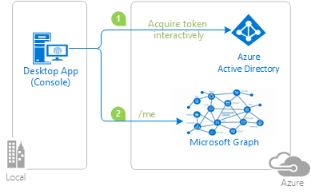
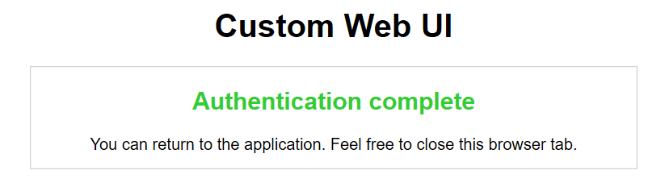
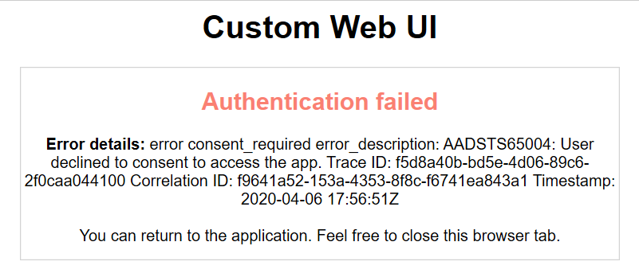

# Using the Microsoft identity platform to call Microsoft Graph API with custom web browser.


## About this sample

### Overview

This sample demonstrates how to use a custom web browser on MSAL.NET.

>Note: **Custom web browser is only available on .NET Core applications.**

1. The .NET Desktop (Console) application uses the Microsoft Authentication Library (MSAL) to obtain a JWT access token from Microsoft Entra ID.
2. The custom web browser will intercept the authorization code request triggered by MSAL and execute it on a new browser tab that is being listened.
3. Once the authorization request is finished (successfully or not), the custom web browser will print a custom HTML block and return the response to MSAL.

### Scenario

The console application:

- gets an access token from Microsoft Entra ID interactively using a custom web browser (restricted to **.net core only**)
- and then calls the Microsoft Graph `/me` endpoint to get the user information, which it then displays in the console.



## How to run this sample

To run this sample, you'll need:

- [Visual Studio 2019](https://aka.ms/vsdownload)
- An Internet connection
- a Microsoft Entra tenant. For more information on how to get a Microsoft Entra tenant, see [How to get a Microsoft Entra tenant](https://azure.microsoft.com/documentation/articles/active-directory-howto-tenant/)
- A user account in your Microsoft Entra tenant. This sample will not work with a Microsoft account (formerly Windows Live account). Therefore, if you signed in to the [Microsoft Entra admin center](https://entra.microsoft.com) with a Microsoft account and have never created a user account in your directory before, you need to do that now.

### Step 1:  Clone or download this repository

From your shell or command line:

```Shell
git clone https://github.com/Azure-Samples/ms-identity-dotnet-desktop-tutorial.git
```

or download and extract the repository .zip file.

> Given that the name of the sample is quiet long, and so are the names of the referenced NuGet packages, you might want to clone it in a folder close to the root of your hard drive, to avoid file size limitations on Windows.

### Step 2:  Register the sample application with your Microsoft Entra tenant

There is one project in this sample. To register it, you can:

- either follow the steps [Step 2: Register the sample with your Microsoft Entra tenant](#step-2-register-the-sample-with-your-azure-active-directory-tenant) and [Step 3:  Configure the sample to use your Microsoft Entra tenant](#choose-the-azure-ad-tenant-where-you-want-to-create-your-applications)
- or use PowerShell scripts that:
  - **automatically** creates the Microsoft Entra applications and related objects (passwords, permissions, dependencies) for you. Note that this works for Visual Studio only.
  - modify the Visual Studio projects' configuration files.

<details>
  <summary>Expand this section if you want to use this automation:</summary>

1. On Windows, run PowerShell and navigate to the root of the cloned directory
1. In PowerShell run:

   ```PowerShell
   Set-ExecutionPolicy -ExecutionPolicy RemoteSigned -Scope Process -Force
   ```

1. Run the script to create your Microsoft Entra application and configure the code of the sample application accordingly.
1. In PowerShell run:

   ```PowerShell
   cd .\AppCreationScripts\
   .\Configure.ps1
   ```

   > Other ways of running the scripts are described in [App Creation Scripts](./AppCreationScripts/AppCreationScripts.md)
   > The scripts also provide a guide to automated application registration, configuration and removal which can help in your CI/CD scenarios.

1. Open the Visual Studio solution and click start to run the code.

</details>

Follow the steps below to manually walk through the steps to register and configure the applications.

#### Choose the Microsoft Entra tenant where you want to create your applications

As a first step you'll need to:

1. Sign in to the [Microsoft Entra admin center](https://entra.microsoft.com) using either a work or school account or a personal Microsoft account.
1. If your account is present in more than one Microsoft Entra tenant, select your profile at the top right corner in the menu on top of the page, and then **switch directory**.
   Change your portal session to the desired Microsoft Entra tenant.

#### Register the client app (Console-Interactive-MultiTarget-v2)

1. Navigate to the Microsoft identity platform for developers [App registrations](https://go.microsoft.com/fwlink/?linkid=2083908) page.
1. Click **New registration** on top.
1. In the **Register an application page** that appears, enter your application's registration information:
   - In the **Name** section, enter a meaningful application name that will be displayed to users of the app, for example `Console-Interactive-MultiTarget-v2`.
   - Change **Supported account types** to **Accounts in any organizational directory and personal Microsoft accounts (e.g. Skype, Xbox, Outlook.com)**.
1. Click on the **Register** button in bottom to create the application.
1. In the app's registration screen, find the **Application (client) ID** value and record it for use later. You'll need it to configure the configuration file(s) later in your code.
1. In the app's registration screen, click on the **Authentication** blade in the left.
   - If you don't have a platform added yet, click on **Add a platform** and select the **Public client (mobile & desktop)** option.
   - In the **Redirect URIs** section, enter the following redirect URIs.
      - `http://localhost`
   - In the **Redirect URIs** | **Suggested Redirect URIs for public clients (mobile, desktop)** section, select **https://login.microsoftonline.com/common/oauth2/nativeclient**

1. Click the **Save** button on top to save the changes.
1. In the app's registration screen, click on the **API permissions** blade in the left to open the page where we add access to the Apis that your application needs.
   - Click the **Add a permission** button and then,
   - Ensure that the **Microsoft APIs** tab is selected.
   - In the *Commonly used Microsoft APIs* section, click on **Microsoft Graph**
   - In the **Delegated permissions** section, select the **User.Read** in the list. Use the search box if necessary.
   - Click on the **Add permissions** button at the bottom.

##### Configure the  client app (Console-Interactive-MultiTarget-v2) to use your app registration

Open the project in your IDE (like Visual Studio) to configure the code.
>In the steps below, "ClientID" is the same as "Application ID" or "AppId".

1. Open the `Console-Interactive-MultiTarget\appsettings.json` file
1. Find the app key `ClientId` and replace the existing value with the application ID (clientId) of the `Console-Interactive-MultiTarget-v2` application copied from the Microsoft Entra admin center.
1. Find the app key `TenantId` and replace the existing value with your Microsoft Entra tenant ID.

### Step 4: Run the sample

Clean the solution, rebuild the solution, and run it.

Start the application, sign-in and check the result in the console.

> [Consider taking a moment to share your experience with us.](https://forms.office.com/Pages/ResponsePage.aspx?id=v4j5cvGGr0GRqy180BHbR73pcsbpbxNJuZCMKN0lURpUREhEVDBOTFBMUVRPUElBUE5WMjdPQ1RaMiQlQCN0PWcu)

## About the code

The relevant code for this sample is the `CustomBrowserWebUi.cs` class, that inherits `ICustomWebUi`. 

> Note that MSAL custom web UI is **only available on .Net Core**.

There are a few considerations about custom web UI:

- MSAL does not have control over the browser, e.g. MSAL cannot close the window, cannot detect if the user decides to navigate away etc. The app using MSAL can only set a cancellation token / timeout.
- On successful navigation to the redirect URI, the application can write a message back to the browser. The experience can be further enhanced by redirecting the browser to a page of your choice.
- In order to capture the result of the authentication, MSAL listens to a localhost socket. Applications must register "http:\localhost" as a redirect URI.

1- On `CustomBrowserWebUi.cs`, we implement the interface `ICustomWebUi`, intercepting the authorization URI:

```csharp
public async Task<Uri> AcquireAuthorizationCodeAsync(
   Uri authorizationUri,
   Uri redirectUri,
   CancellationToken cancellationToken)
{
   if (!redirectUri.IsLoopback)
   {
         throw new ArgumentException("Only loopback redirect uri is supported with this WebUI. Configure http://localhost or http://localhost:port during app registration. ");
   }

   Uri result = await InterceptAuthorizationUriAsync(authorizationUri,redirectUri,cancellationToken)
         .ConfigureAwait(true);

   return result;
}
```

The custom web UI can be used in the `AcquireTokenInteractive()` method:

```c#
 await application.AcquireTokenInteractive(scopes)
   .WithCustomWebUi(new CustomBrowserWebUi()) //Using our custom web ui
   .ExecuteAsync();
```

2- The interception method, `InterceptAuthorizationUriAsync`, opens a new tab on the OS default browser and navigates to the authorization URI, while listening to its response. Then, it displays an HTML block based on the authorization response.

```csharp
private async Task<Uri> InterceptAuthorizationUriAsync(
   Uri authorizationUri,
   Uri redirectUri,
   CancellationToken cancellationToken)
{
   OpenBrowser(authorizationUri.ToString());
   using (var listener = new SingleMessageTcpListener(redirectUri.Port))
   {
         Uri authCodeUri = null;
         await listener.ListenToSingleRequestAndRespondAsync(
            (uri) =>
            {
               Trace.WriteLine("Intercepted an auth code url: " + uri.ToString());
               authCodeUri = uri;

               return GetMessageToShowInBroswerAfterAuth(uri);
            },
            cancellationToken)
         .ConfigureAwait(false);

         return authCodeUri;
   }
}
```

3- Once the authorization response gets back, the opened tab will display a custom successful or failure message, MSAL will process the response accordingly and the custom web UI flow is concluded.

Success custom message:


Failure custom message:


## Community Help and Support

Use [Stack Overflow](http://stackoverflow.com/questions/tagged/msal) to get support from the community.
Ask your questions on Stack Overflow first and browse existing issues to see if someone has asked your question before.
Make sure that your questions or comments are tagged with [`azure-active-directory` `msal` `dotnet`].

If you find a bug in the sample, please raise the issue on [GitHub Issues](../../../../issues).

To provide a recommendation, visit the following [User Voice page](https://feedback.azure.com/forums/169401-azure-active-directory).

## Contributing

If you'd like to contribute to this sample, see [CONTRIBUTING.MD](/CONTRIBUTING.md).

This project has adopted the [Microsoft Open Source Code of Conduct](https://opensource.microsoft.com/codeofconduct/). For more information, see the [Code of Conduct FAQ](https://opensource.microsoft.com/codeofconduct/faq/) or contact [opencode@microsoft.com](mailto:opencode@microsoft.com) with any additional questions or comments.

## More information

For more information, see MSAL.NET's conceptual documentation:

- [MSAL.NET's conceptual documentation](https://aka.ms/msal-net)
- [Microsoft identity platform (Microsoft Entra ID for developers)](https://docs.microsoft.com/azure/active-directory/develop/)
- [Quickstart: Register an application with the Microsoft identity platform](https://docs.microsoft.com/azure/active-directory/develop/quickstart-register-app)
- [Quickstart: Configure a client application to access web APIs](https://docs.microsoft.com/azure/active-directory/develop/quickstart-configure-app-access-web-apis)

- [Understanding Microsoft Entra application consent experiences](https://docs.microsoft.com/azure/active-directory/develop/application-consent-experience)
- [Understand user and admin consent](https://docs.microsoft.com/azure/active-directory/develop/howto-convert-app-to-be-multi-tenant#understand-user-and-admin-consent)
- [Application and service principal objects in Microsoft Entra ID](https://docs.microsoft.com/azure/active-directory/develop/app-objects-and-service-principals)

For more information about how OAuth 2.0 protocols work in this scenario and other scenarios, see [Authentication Scenarios for Microsoft Entra ID](http://go.microsoft.com/fwlink/?LinkId=394414).
