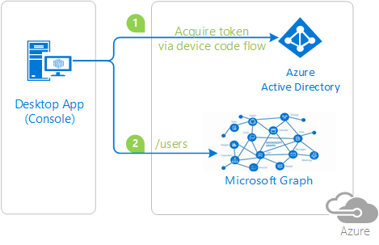

# Sign-in a user with the Microsoft identity platform using the device code flow and call Microsoft Graph.


## About this sample

### Overview

This sample demonstrates a .NET Desktop (Console) application calling The Microsoft Graph.

1. The .NET Desktop (Console) application uses the [Microsoft Authentication Library (MSAL)](https://docs.microsoft.com/azure/active-directory/develop/msal-overview) to obtain a JWT [access token](https://docs.microsoft.com/azure/active-directory/develop/access-tokens) from Azure Active Directory (Azure AD), using device code flow.
2. The access token is used as a bearer token to authenticate the user when calling the Microsoft Graph.

> Looking for previous versions of this code sample? Check out the tags on the [releases](../../releases) GitHub page.



### Scenario

This console application displays a code and a URL. the user will open the URL in the browser and enter the code to start the authentication process.
Once the authentication process completes, the console application will resume and call Microsoft Graph on behalf of the user.

## How to run this sample

To run this sample, you'll need:

- [Visual Studio 2019](https://aka.ms/vsdownload)
- An Internet connection
- An Azure Active Directory (Azure AD) tenant. For more information on how to get an Azure AD tenant, see [How to get an Azure AD tenant](https://azure.microsoft.com/documentation/articles/active-directory-howto-tenant/)
- A user account in your Azure AD tenant. This sample will not work with a Microsoft account (formerly Windows Live account). Therefore, if you signed in to the [Azure portal](https://portal.azure.com) with a Microsoft account and have never created a user account in your directory before, you need to do that now.

### Step 1:  Clone or download this repository

From your shell or command line:

```Shell
git clone https://github.com/Azure-Samples/ms-identity-dotnet-desktop-tutorial.git
```

or download and extract the repository .zip file.

> Given that the name of the sample is quiet long, and so are the names of the referenced NuGet packages, you might want to clone it in a folder close to the root of your hard drive, to avoid the 256 character path length limitation on Windows.

### Step 2:  Register the sample application with your Azure Active Directory tenant

There is one project in this sample. To register it, you can:

- either follow the steps [Step 2: Register the sample with your Azure Active Directory tenant](#step-2-register-the-sample-with-your-azure-active-directory-tenant) and [Step 3:  Configure the sample to use your Azure AD tenant](#choose-the-azure-ad-tenant-where-you-want-to-create-your-applications)
- or use PowerShell scripts that:
  - **automatically** creates the Azure AD applications and related objects (passwords, permissions, dependencies) for you. Note that this works for Visual Studio only.
  - modify the Visual Studio projects' configuration files.

<details>
  <summary>Expand this section if you want to use this automation:</summary>

1. On Windows, run PowerShell and navigate to the root of the cloned directory
1. In PowerShell run:

   ```PowerShell
   Set-ExecutionPolicy -ExecutionPolicy RemoteSigned -Scope Process -Force
   ```

1. Run the script to create your Azure AD application and configure the code of the sample application accordingly.
1. In PowerShell run:

   ```PowerShell
   cd .\AppCreationScripts\
   .\Configure.ps1
   ```

   > Other ways of running the scripts are described in [App Creation Scripts](./AppCreationScripts/AppCreationScripts.md)
   > The scripts also provide a guide to automated application registration, configuration and removal which can help in your CI/CD scenarios.

1. Open the Visual Studio solution and click start to run the code.

</details>

Follow the steps below to manually walk through the steps to register and configure the applications in the Azure portal.

#### Choose the Azure AD tenant where you want to create your applications

As a first step you'll need to:

1. Sign in to the [Azure portal](https://portal.azure.com) using either a work or school account or a personal Microsoft account.
1. If your account is present in more than one Azure AD tenant, select your profile at the top right corner in the menu on top of the page. Then select **switch directory** to change your portal session to the desired Azure AD tenant.

#### Register the client app (Console-DeviceCodeFlow-MultiTarget-v2)

1. Navigate to the Microsoft identity platform for developers [App registrations](https://go.microsoft.com/fwlink/?linkid=2083908) page.
1. Select **New registration**.
1. In the **Register an application page** that appears, enter your application's registration information:
   - In the **Name** section, enter a meaningful application name that will be displayed to users of the app, for example `Console-DeviceCodeFlow-MultiTarget-v2`.
   - Under **Supported account types**, select **Accounts in this organizational directory only**.
1. Select **Register** to create the application.
1. In the app's registration screen, find and note the **Application (client) ID**. You use this value in your app's configuration file(s) later in your code.
   - In the **Advanced settings** | **Default client type** section, flip the switch for `Treat application as a public client` to **Yes**.
1. Select **Save** to save your changes.
1. In the app's registration screen, click on the **API permissions** blade in the left to open the page where we add access to the Apis that your application needs.
   - Click the **Add a permission** button and then,
   - Ensure that the **Microsoft APIs** tab is selected.
   - In the *Commonly used Microsoft APIs* section, click on **Microsoft Graph**
   - In the **Delegated permissions** section, select the **User.Read** in the list. Use the search box if necessary.
   - Click on the **Add permissions** button at the bottom.

##### Configure the  client app (Console-DeviceCodeFlow-MultiTarget-v2) to use your app registration

Open the project in your IDE (like Visual Studio) to configure the code.
>In the steps below, "ClientID" is the same as "Application ID" or "AppId".

1. Open the `Console-DeviceCodeFlow-v2\appsettings.json` file
1. Find the app key `ClientId` and replace the existing value with the application ID (clientId) of the `Console-DeviceCodeFlow-MultiTarget-v2` application copied from the Azure portal.
1. Find the app key `TenantId` and replace the existing value with your Azure AD tenant ID.

### Step 4: Run the sample

Clean the solution, rebuild the solution, and run it.

Use a web browser to open the Url (https://microsoft.com/devicelogin) that is displayed in console app. Input the code presented in the console , sign-in and check the result of the operation back in the console.

## About the code

The relevant code for this sample is in the `Program.cs` file, in the Main() method. The steps are:

1- We use the  `appsettings.json` as our configuration file and build the **PublicClientApplicationOptions** object with the app registration settings
```csharp
var builder = new ConfigurationBuilder()
    .SetBasePath(System.IO.Directory.GetCurrentDirectory())
    .AddJsonFile("appsettings.json");

configuration = builder.Build();

appConfiguration = configuration.Get<PublicClientApplicationOptions>();
```

2- The method **SignInUserAndGetTokenUsingMSAL** contains the code to initialize MSAL and get an access token for MS Graph.
Try to acquire an access token for Microsoft Graph silently, but if it fails, do it using `AcquireTokenWithDeviceCode()`.
This method will give you code, which will have the lifetime of 15 minutes, and URL for authentication.

```csharp
private static async Task<string> SignInUserAndGetTokenUsingMSAL(PublicClientApplicationOptions configuration, string[] scopes)
{
    // build the AAd authority Url
    string authority = string.Concat(configuration.Instance, configuration.TenantId);

    // Initialize the MSAL library by building a public client application
    application = PublicClientApplicationBuilder.Create(configuration.ClientId)
                                            .WithAuthority(authority)
                                            .WithDefaultRedirectUri()
                                            .Build();

    AuthenticationResult result;

    try
    {
        var accounts = await application.GetAccountsAsync();
        result = await application.AcquireTokenSilent(scopes, accounts.FirstOrDefault()).ExecuteAsync();
    }
    catch (MsalUiRequiredException)
    {
        result = await application.AcquireTokenWithDeviceCode(scopes, deviceCodeResult =>
           {
               Console.WriteLine(deviceCodeResult.Message);
               return Task.FromResult(0);
           }).ExecuteAsync();
    }
    return result.AccessToken;
}
```

3- The method **SignInAndInitializeGraphServiceClient** initializes the Graph SDK.

```csharp
private async static Task<GraphServiceClient> SignInAndInitializeGraphServiceClient(PublicClientApplicationOptions configuration, string[] scopes)
{
    GraphServiceClient graphClient = new GraphServiceClient(MSGraphURL,
        new DelegateAuthenticationProvider(async (requestMessage) =>
        {
            requestMessage.Headers.Authorization = new AuthenticationHeaderValue("bearer", await SignInUserAndGetTokenUsingMSAL(configuration, scopes));
        }));

    return await Task.FromResult(graphClient);
}

4- The method **CallMSGraph** uses the initialized Graph SDK to make a call to Graph and fetch data from it.
```csharp
private static async Task CallMSGraph(GraphServiceClient graphClient)
{
    var me = await graphClient.Me.Request().GetAsync();
   
    // Printing the results
    Console.Write(Environment.NewLine);
    Console.WriteLine("-------- Data from call to MS Graph --------");
    Console.Write(Environment.NewLine);
    Console.WriteLine($"Id: {me.Id}");
    Console.WriteLine($"Display Name: {me.DisplayName}");
    Console.WriteLine($"Email: {me.Mail}");
}
```
## Community Help and Support

Use [Stack Overflow](http://stackoverflow.com/questions/tagged/msal) to get support from the community.
Ask your questions on Stack Overflow first and browse existing issues to see if someone has asked your question before.
Make sure that your questions or comments are tagged with [`azure-active-directory` `msal` `dotnet`].

If you find a bug in the sample, please raise the issue on [GitHub Issues](../../issues).

To provide a recommendation, visit the following [User Voice page](https://feedback.azure.com/forums/169401-azure-active-directory).

## Contributing

If you'd like to contribute to this sample, see [CONTRIBUTING.MD](/CONTRIBUTING.md).

This project has adopted the [Microsoft Open Source Code of Conduct](https://opensource.microsoft.com/codeofconduct/). For more information, see the [Code of Conduct FAQ](https://opensource.microsoft.com/codeofconduct/faq/) or contact [opencode@microsoft.com](mailto:opencode@microsoft.com) with any additional questions or comments.

## More information

For more information, see MSAL.NET's conceptual documentation:

- [MSAL.NET's conceptual documentation](https://aka.ms/msal-net)
- [Device code flow](https://docs.microsoft.com/azure/active-directory/develop/v2-oauth2-device-code)
- [Microsoft identity platform (Azure Active Directory for developers)](https://docs.microsoft.com/azure/active-directory/develop/)
- [Quickstart: Register an application with the Microsoft identity platform](https://docs.microsoft.com/azure/active-directory/develop/quickstart-register-app)
- [Quickstart: Configure a client application to access web APIs](https://docs.microsoft.com/azure/active-directory/develop/quickstart-configure-app-access-web-apis)
- [Understanding Azure AD application consent experiences](https://docs.microsoft.com/azure/active-directory/develop/application-consent-experience)
- [Understand user and admin consent](https://docs.microsoft.com/azure/active-directory/develop/howto-convert-app-to-be-multi-tenant#understand-user-and-admin-consent)
- [Application and service principal objects in Azure Active Directory](https://docs.microsoft.com/azure/active-directory/develop/app-objects-and-service-principals)
- [Acquiring Tokens](https://aka.ms/msal-net-acquiring-tokens)
- [National Clouds](https://docs.microsoft.com/azure/active-directory/develop/authentication-national-cloud#app-registration-endpoints)

For more information about how OAuth 2.0 protocols work in this scenario and other scenarios, see [Authentication Scenarios for Azure AD](http://go.microsoft.com/fwlink/?LinkId=394414).
